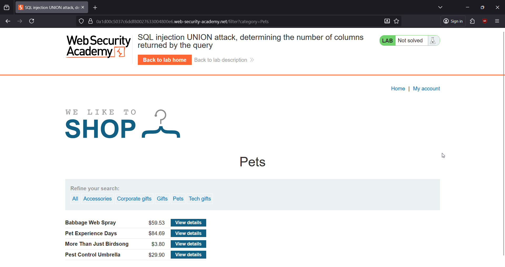
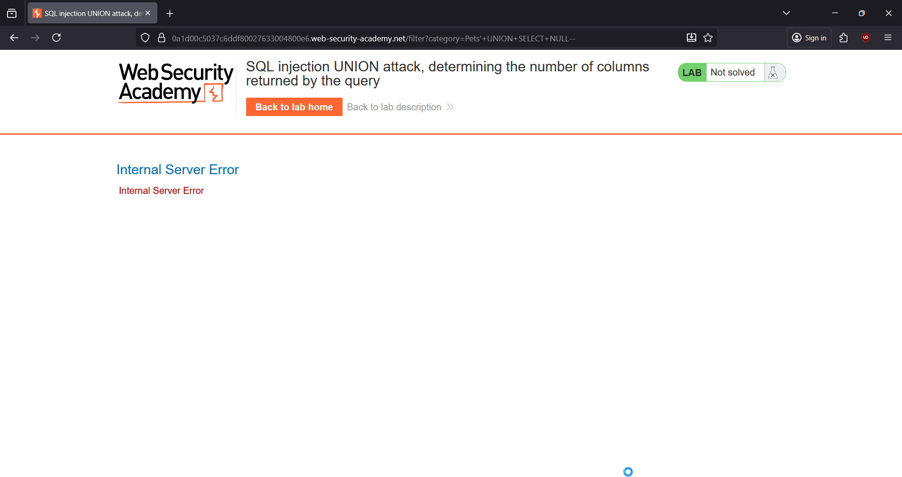
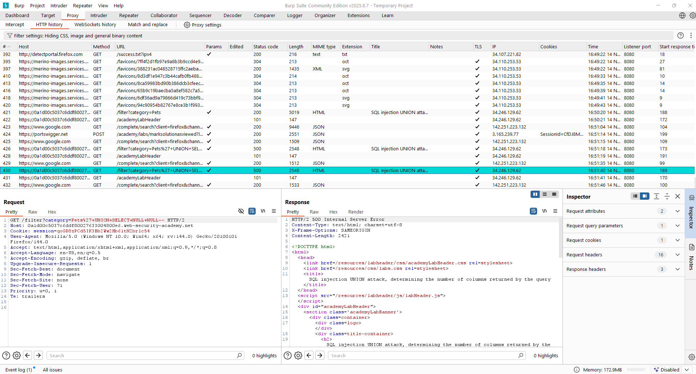
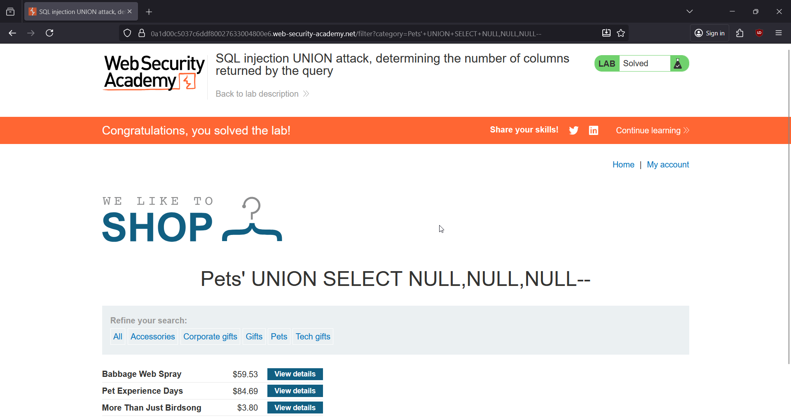

# 🎯 SQL Injection: Determining the Number of Columns Returned by the Query

**Write-Up by Aditya Bhatt | UNION-Based SQLi | Column Enumeration | BurpSuite**

Before any UNION-based SQL injection can work, you *must* figure out the number of columns the original query returns. This PortSwigger lab gives us a classic opportunity to do exactly that using a simple, clean NULL-based enumeration technique.

[Lab Link](https://portswigger.net/web-security/sql-injection/union-attacks/lab-determine-number-of-columns) <br/>


---

# 🧪 TL;DR

* The category filter is injectable.
* UNION-based SQLi needs **exact column count** to avoid syntax errors.
* We inject increasing numbers of `NULL` values.
* 1 NULL → error
* 2 NULLs → error
* 3 NULLs → **success**
* Therefore the query returns **3 columns**.

---

# 🌐 Brief Intro

UNION SQL injections work *only* when:

1. The number of columns match.
2. The datatypes match.

So the first step in almost every UNION-based SQLi is figuring out how many columns the original SELECT statement uses. The safest technique? **Start with 1 NULL and keep adding more until the page renders without an error.**

This lab is a perfect demonstration of that process.

---

# 🧬 Step-By-Step PoC (Screenshots included)

## **1. Open the Lab & Choose a Product Category**

Selected a category like **Lifestyle** to capture the request inside Burp.



➤ *Why?*
We need a baseline request so we can inject into the `category` parameter.

---

## **2. Test with a UNION + 1 NULL**

Injected the following into the category parameter:

```
+UNION+SELECT+NULL--
```

This immediately caused an error.



➤ *Why?*
If the number of columns doesn’t match, the backend throws an SQL error → meaning the real query uses **more than 1 column**.

---

## **3. Test with 2 NULL Columns**

Next attempt:

```
+UNION+SELECT+NULL,NULL--
```

Still an error.


➤ *Why?*
Still mismatched → the original query uses **more than 2 columns**.

---

## **4. Test with 3 NULL Columns → Success**

Final attempt:

```
+UNION+SELECT+NULL,NULL,NULL--
```

This time the page loaded normally and included our injected row.



➤ *Why?*
No errors = column count matched.
Therefore, the original SQL query returns exactly **3 columns**.

This solves the lab.

---

# 🎉 Lab SOLVED

We successfully identified the correct number of columns (3) required for UNION-based SQL injection. This technique will now be used in upcoming labs to extract data, determine data types, and build full exploitation payloads.



---

# 🧠 Key Takeaways

* UNION SQLi requires the **exact column count**.
* Incrementing NULLs is the safest way to detect it.
* Once the page renders without an error → match found.
* This enumeration phase is crucial before data extraction.

---

# 👋 Final Thoughts

This lab sets the groundwork for all future UNION-based SQL injections. Once you master NULL enumeration, building full payloads becomes significantly easier. On to the next challenge!

Till then,<br/>
Stay curious, stay sharp.<br/>
— **Aditya Bhatt** 🔥

---
